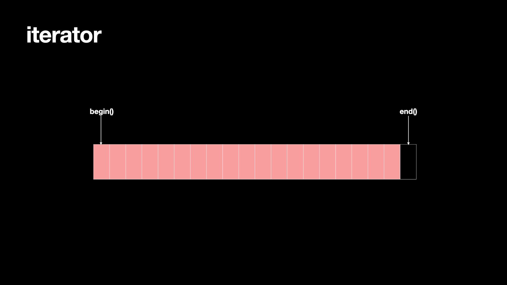
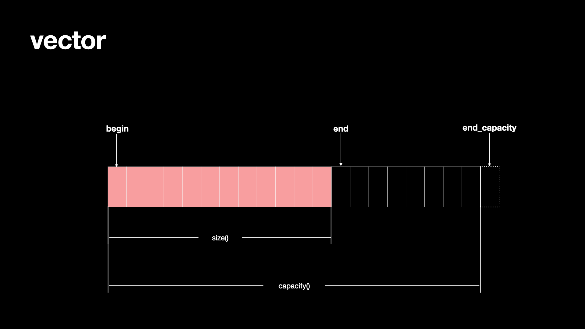
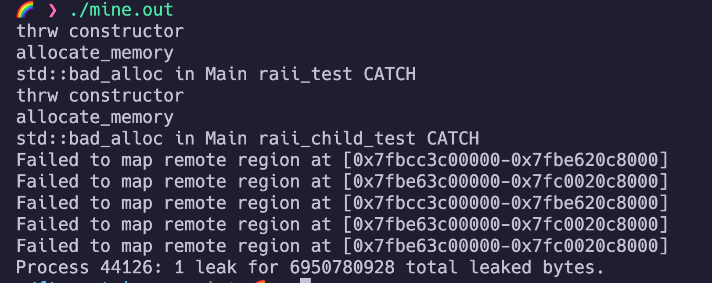
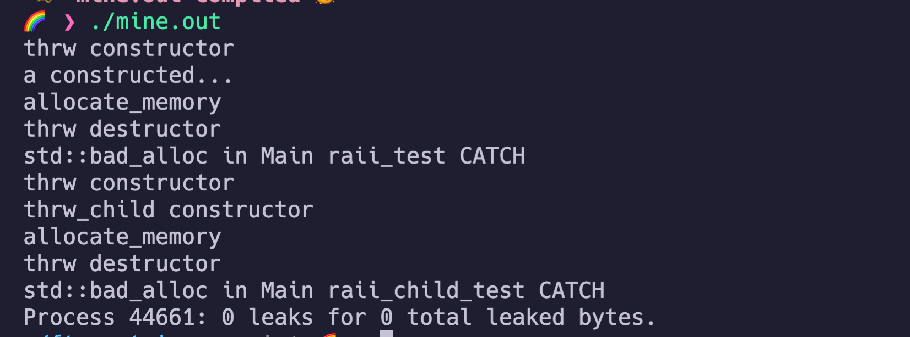
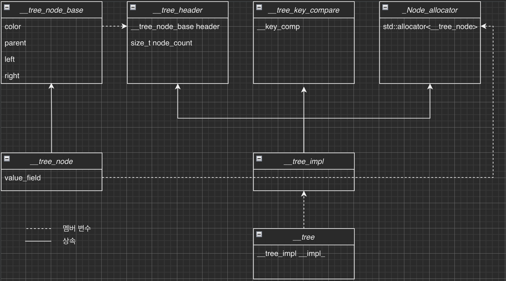
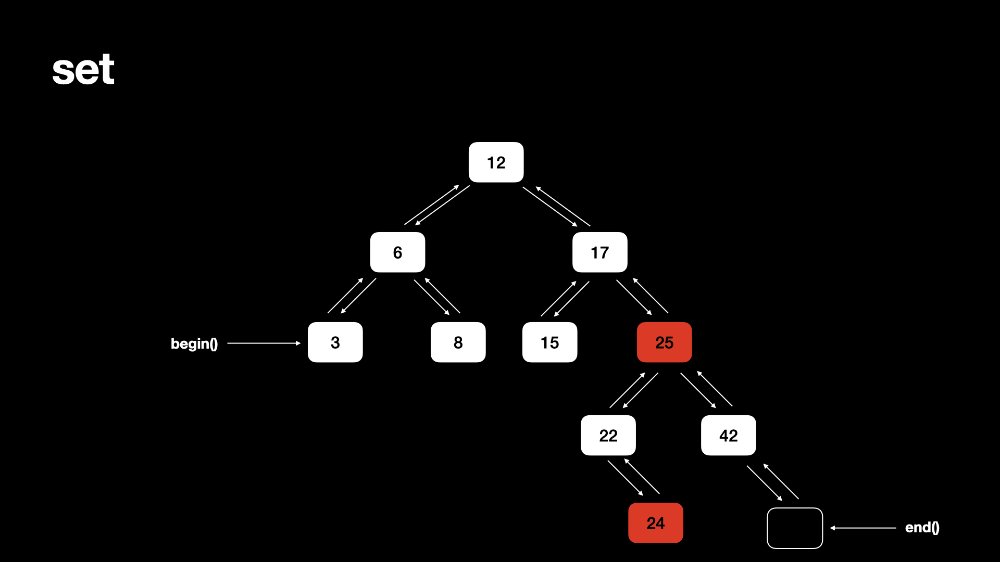

# ft_containers

My c++ STL containers (c++98)

- vector
- map
- set
- stack
- iterator


# Index  

- [ft_containers](#ft_containers)
- [Index](#index)
- [Convention](#convention)
- [Functional Specification](#functional-specification)
- [About STL(Standard Template Library) containers](#about-stlstandard-template-library-containers)
- [Keywords](#keywords)
	- [Functor (Function Object)](#functor-function-object)
		- [functor의 분류](#functor의-분류)
		- [functor vs function](#functor-vs-function)
		- [functor vs function pointer](#functor-vs-function-pointer)
		- [functor vs lambda expression(c++11)](#functor-vs-lambda-expressionc11)
	- [stack unwinding](#stack-unwinding)
	- [dynamic exception specification _(deprecated c++11, removed c++17)_](#dynamic-exception-specification-deprecated-c11-removed-c17)
	- [Exception safety](#exception-safety)
	- [RAII (Resource Acquisition Is Initialization)](#raii-resource-acquisition-is-initialization)
	- [\*\_traits](#_traits)
	- [type_traits](#type_traits)
	- [iterator_traits](#iterator_traits)
		- [InputIterator](#inputiterator)
	- [SFINAE (Substitution Failure Is Not An Error)](#sfinae-substitution-failure-is-not-an-error)
		- [⚠️ Default Argument Do Not Participate in Overload Resolution](#️-default-argument-do-not-participate-in-overload-resolution)
	- [enable_if](#enable_if)
- [Allocator](#allocator)
	- [C++ named requirements: Allocator](#c-named-requirements-allocator)
	- [C++ std::allocator](#c-stdallocator)
- [Vector](#vector)
	- [Prototype](#prototype)
	- [Member types](#member-types)
	- [Member functions](#member-functions)
		- [Iterators:](#iterators)
		- [Capacity:](#capacity)
		- [Element access:](#element-access)
		- [Modifiers:](#modifiers)
		- [Allocator:](#allocator-1)
		- [Non-member functions:](#non-member-functions)
		- [\_\_vector_base](#__vector_base)
		- [\_\_vector_base methods](#__vector_base-methods)
		- [private member function in vector](#private-member-function-in-vector)
		- [exceptions](#exceptions)
- [Stack](#stack)
- [RB-Tree (base of set and map)](#rb-tree-base-of-set-and-map)
	- [RB-tree:](#rb-tree)
	- [구조](#구조)
		- [tree iterator](#tree-iterator)
	- [RB-tree Node Algorithms](#rb-tree-node-algorithms)
	- [Member types:](#member-types-1)
	- [Member functions:](#member-functions-1)
		- [constructor:](#constructor)
- [map / set](#map--set)
	- [prototype](#prototype-1)
	- [member types](#member-types-2)
	- [Member functions](#member-functions-2)
		- [Iterators:](#iterators-1)
		- [Capacity:](#capacity-1)
		- [Element access:](#element-access-1)
		- [Modifiers:](#modifiers-1)
		- [Observers:](#observers)
		- [Operations:](#operations)
		- [Allocator:](#allocator-2)
		- [Non-member functions:](#non-member-functions-1)
- [TODO](#todo)
- [Reference](#reference)

# Convention

- STL의 메소드들에 맞게, snake_case 사용
- 최대한 공식문서([1](https://en.cppreference.com/w/), [2](https://www.cplusplus.com/))와 일치하도록 작성
- 라이브러리에서만 사용되는 메소드, 클래스는 __class_name 과 같은 형태로 작성
- 외부로 공개되지 않는 변수는 __variable_name_ 과 같은 형태로 작성
- format는 [google style guide](https://google.github.io/styleguide/cppguide.html)에 따름
- private한 클래스 __class_name
- private한 type은 _Type_Name
- private 멤버 변수 \_\_variable\_name_
- private한 함수의 지역변수 \_\_variable\_name

# Functional Specification

- c++98 기준 모든 기능 구현
- 같은 exception-safety를 보장
- c++98로 가능한 Template Meta Programming 최대한 활용

# About STL(Standard Template Library) containers

프로그래밍에 있어 자주 사용하는 자료구조들을 class template로 만들어 둬서 다른 object들을 element로 자료구조에 맞게 저장해줌. 이런 컨테이너는 각 element를 위한 공간을 관리해주고, 각 데이터에 접근하는 멤버 함수를 제공하며 이터레이터를 통하여 직접적으로 접근하게도 해줌.

- sequence container
  - sequentially하게 접근할 수 있는 자료구조
	- vector, deque, list, array(c++11), forward_list(c++11)이 이에 속함
- associative container
  - 빠르게 탐색할 수 있는 정렬된 자료구조(`O(log(n))`)
  - element들은 position이 아니라 key에 의해 접근됨
	- set, multiset, map, multimap이 여기에 속함
- unordered associative container (c++11)
  - 정렬되지 않고 hash가 되어있는 자료구조.
  - 탐색에 `amortized O(1) ~ O(n)` 의 시간복잡도를 지님.
	- unordered_set, unordered_multiset, unordered_map, unordered_multimap이 여기에 속함
- container adapter
  - sequential container의 다른 인터페이스를 제공하는 container adaptor
	- stack, queue, priority_queue가 여기에 속함

# Keywords

컨테이너 구현에 있어서 필요한 지식들

## Functor (Function Object)

`function + object`를 합친 말로, 간단히 말하자면 `operator()` 오버로딩을 통하여 함수처럼 작동하는 클래스(구조체)를 만들고, 객체를 함수처럼 사용하는것.
이러한 `functor`은 STL의 알고리즘에 많이 사용됨.

```c++
struct Add{
	Add(int toAdd) : _toAdd(toAdd) {}
	int operator()(int x){
		return x + _toAdd;
	}
	private:
	int _toAdd;
};

int main(){
	Add add_42(42); // state 저장
	Add add_13(13);
	int result_42 = add_42(2);
	int result_13 = add_13(2);
	std::vector<int> v(10, 10);
	std::transform(v.begin(), v.end(), v.begin(), add_42);
}
```

### functor의 분류

- generator: 인자 없이 사용하는 functor
- unary: 하나의 인자를 필요로 하는 functor
- binary: 두개의 인자를 필요로 하는 functor
- predicate: boolean 값을 리턴하는 functor, Unary predicate, Binary predicate 등으로 혼합해서 씀.
- operator: 연산값을 리턴하는 functor

### functor vs function

- functor는 객체에 () 연산자를 오버로드 한 형태로 함수처럼 작동하는 객체임.
  - 객체이기 때문에 인자로 넘길 수 있으며 callback 형태로 사용할 수 있음.
- callback 형태이기 때문에 STL의 알고리즘과 호환이 잘됨.
- state를 저장할 수 있음
- function은 특정 함수의 인자로 넘기기 위해서는 다른 작업을 해줘야함.(function pointer or function object)

### functor vs function pointer

- functor는 type이 명확하게 정의됨.
	- 따라서 템플릿의 인자로도 사용할 수 있음.
	- 컴파일 단계에서 최적화가 가능하여 inline화 가능.
	- state를 저장할 수 있으며 일반 멤버 변수 / 함수 또한 가질 수 있음.
	- structure나 class를 만들어야 해서 코드의 양이 많음.
- function pointer는 type만 같다면 다른 function도 들어갈 수 있음.
	- 컴파일시 판별되는게 아니라, 런타임에서 함수가 판별되므로 오버헤드가 생기며 inline화 불가능.
	- state를 저장할 수 없음.

### functor vs lambda expression(c++11)

둘 다 inline화 가능하며 lambda expression은 inline이 default임
- lambda expression은 functor와 유사하지만 class를 define할 필요가 없어서 더 간편함. syntax sugar 같은 느낌

[MS functor vs lambda expression](https://docs.microsoft.com/en-us/cpp/cpp/lambda-expression-syntax?view=msvc-170)

[what are c++ functors and their uses (stackoverflow 따봉 1000개)](https://stackoverflow.com/questions/356950/what-are-c-functors-and-their-uses)

[about functor](https://www.bogotobogo.com/cplusplus/functors.php)

[function object wikipedia](https://en.wikipedia.org/wiki/Function_object)

## stack unwinding

- 스택에서 함수 진행 중, exception이 발생했을 시 catch를 찾아가면서 콜스택을 되돌아가게 되고, 이때 콜스택 하나 하나를 빠져나올 때 마다 해당 스택을 정리해주는것. 만약, 스택 내부에서 힙에 할당된 메모리가 있으면 릭이 발생함! (RAII가 대표적인 해결책.)

```c++
void f3() {
	int *c = new int[100]; // will be leak
	std::string s = "this is stack... would be destroyed";
	throw "exception!";
}

void f2() { f3() }

void f1() { try { f2() } catch (...) { std::cout << "back to here!\n"; } }
```

- `f1->f2->f3` 순으로 스택이 쌓이며, `f3->f2->f1` 순으로 스택이 해제됨.
- RAII를 보장하여 `f3` 의 스코프를 나가면서 메모리 해제가 보장된다면, leak이 발생하지 않음.

## dynamic exception specification _(deprecated c++11, removed c++17)_

- `throw(expression)`을 통하여 특정 함수가 어떤 exception을 던지는지 설정 가능
- 만약 expression에 없는 exception이 throw 된다면, std::unexpected가 작동함.
- `throw()` 형태로 쓴다면, 해당 함수는 exception을 던지지 않는다는 의미가 됨.
- 프로그래머의 의도를 함수에 녹여낼 수 있으며, 컴파일러 상에서 최적화도 가능해짐.
- 하지만 [여러가지 이유](https://stackoverflow.com/questions/13841559/deprecated-throw-list-in-c11)로 삭제됨

  - 런타임시 체크되어서 프로그래머가 모든 runtime-failure를 다룰 수 없음.
  - 오히려 런타임 오버헤드가 생김.
  - generic code에서 사용성이 떨어짐. 해당 함수가 던질 수 있는 exception이 늘어나면 고쳐야할게 더 많아짐.
  - 실제로, 함수가 아무 exception이나 던지거나(`throw(...)`이 없을때) 또는 exception을 절대 던지지 않는 상황(`throw()`)에서만 최적화가 가능
  - 이에 맞게 [noexcept](https://en.cppreference.com/w/cpp/language/noexcept_spec)로 대체됨.
  - 따라서, `#define FT_NOEXCEPT throw()` 로 `noexcept` 대체!

- std::unexpected

  - `std::unexpected_handler`가 실행되는데, 기본 핸들러가 `std::terminate`이므로 `std::abort()`를 통해 프로그램이 종료됨

## Exception safety

<details> 
<summary> 원문 </summary>

> The C++ standard library provides a generally useful conceptual framework for design for exception-safe program components. The library provides one of the following guarantees for every library operation:
>
> - The basic guarantee for all operations: The basic invariants of all objects are maintained, and no resources, such as memory, are leaked. In particular, the basic invariants of every built-in and standard-library type guarantee that you can destroy an object or assign to it after every standard-library operation (§iso.17.6.3.1).
> - The strong guarantee for key operations: in addition to providing the basic guarantee, either the operation succeeds, or it has no effect. This guarantee is provided for key operations, such as `push_back(), single-element insert() on a list, and uninitialized_copy()`.
> - The nothrow guarantee for some operations: in addition to providing the basic guarantee, some operations are guaranteed not to throw an exception. This guarantee is provided for a few simple operations, such as `swap() of two containers and pop_back()`.
>   > _Reference : The c++ Programming language, 4rd edition_

</details>

- The basic guarantee:
  - 모든 객체가 유지되며 리소스가 부족한 상태에선 누수가 발생하지 않음. 특히, 빌트인 혹은 표준 라이브러리에서 the basic guarantee를 보장할 땐 객체를 소멸시키거나 값을 할당할 수 있음.
- The strong Guarantee for key operations:
  - the basic guarantee에 추가로 operation이 실패시 아무런 영향을 미치지 않음.
- The nothrow guarantee for some operations:
  - the basic guarantee에 추가로 일부 operation은 예외를 발생시키지 않음.
  
[Stroustrup 님의 standard library exception safety](https://www.stroustrup.com/3rd_safe.pdf)

[한국문서](https://scvgoe.github.io/2019-07-06-Exception-Safety/)

## RAII (Resource Acquisition Is Initialization)

exception safety를 보장하기 위한 방법중 하나.
초기화에 성공하면 리소스가 존재하는것을 보장해줘야 하며, 초기화에 실패시 (construct 실패) 자원을 해제해줘야함. 또한, 소멸자 호출 시 사용한 리소스들을 모두 잘 해제해줘야함. 따라서 객체가 사용하는 자원은 객체의 수명 내에서 관리됨.

따라서, 스코프에서 객체를 생성하고 스코프에서 나올 때, 모든 자원이 정상적으로 반환되면 됨!

<details> 
<summary> 참고 </summary>

> The ‘‘resource acquisition is initialization’’ technique (§14.4) can be used to reduce the amount of
> code needing to be written and to make the code more stylized. In this case, the key resource
> required by the vector's memory to hold its elements. By providing an auxiliary class to represent
> the notion of memory used by a vector, we can simplify the code and decrease the chance of accidentally forgetting to release it:

```c++
template<class T, class A= allocator<T> >
struct vector_base{
	A alloc; // allocator
	T* v;  // start of allocation
	T* space; // end of element sequence, start of space allocated for possible expansion
	T* last; // end of allocated space
	vector_base(const A& a, typename A: :size_type n)
	: alloc(a) , v(a.allocate(n)) , space(v + n) , last(v + n) { }
	~vector_base() { alloc.deallocate(v,last - v) ; }
};
```

이 문서 [__vector_base](#__vector_base)의 "간단한 테스트" 참고

[Stroustrup's document](https://www.stroustrup.com/3rd_safe.pdf)

[한국어 문서](https://occamsrazr.net/tt/297)

[\_\_base_vector](https://stackoverflow.com/questions/50050659/what-is-going-on-with-vector-base-common)

</details>

## \*\_traits

> A traits class provides a way of associating information with a compile-time entity (a type, integral constant, or address).

c++에는 `allocator_traits`, `type_traits`, `iterator_traits`, `char_traits` 등 수많은 `*_traits`가 존재하며 STL에서 이런 `*_trait`가 정말 많이 쓰임. 이는 컴파일 타임에 타입을 특성화 해주기 위함이며, 타입이 중요한 메타 프로그래밍에서 많이 쓰임...

`iterator_traits`를 활용하여 5가지 이터레이터에 대한 generic한 코드를 짤 수 있고, `char_traits`를 통하여 `char` 과 `wchar`를 묶어줄 수 있으며 `type_traits`를 이용하여 컴파일 타임에 `true, false`를 사용할 수 있는 등 다양한 기능을 제공해줌

이러한 `traits`은 주로 템플릿 특수화를 통하여 구현됨!

[자세한 설명](http://egloos.zum.com/sweeper/v/3007176)

## type_traits

TODO : 정리하기
- `integral_constant`
  - `true_type`
  - `false_type`
- `is_integral`
- `is_same`
- `remove_cv`
- `enable_if`


## iterator_traits




<p align='center' color='gray'> Reference: https://www.cplusplus.com/reference/iterator/ </p>

이터레이터 예시 이미지 넣기

### InputIterator

값이 increment되면 이전의 값들의 복사본은 invalidate 될 수 있음.... 왜? 문자를 하나씩 받다가 버퍼가 가득 차면 그냥 버리는 경우를 생각하자.
-> [why does an input iterator invalidate itself after incrementing](https://stackoverflow.com/questions/56319796/why-does-an-input-iterator-invalidate-itself-after-incrementing)

## SFINAE (Substitution Failure Is Not An Error)

c++에서 컴파일시 타입에 맞는 [함수](https://en.cppreference.com/w/cpp/language/functions)를 찾아가는 과정은 매우 복잡하며, 이 과정에서 수많은 후보가 생김.

1. name lookup 을 통하여 함수 이름을 찾음.
2. ADL을 통하여 매칭되는 함수를 찾음. (이 과정에서 암시적 형변환이 일어날 수 있음)
3. 템플릿 함수는 타입이 정해지지 않았으므로 인스턴스화가 될 필요가 있음.
4. 명시적 혹은 암시적으로 템플릿 함수가 인스턴스화가 되지만, 항상 템플릿의 모든 인자가 정해지지는 않음.
5. 이때 가능하다면, 컴파일러가 템플릿의 인자를 추론함(Template argument deduction)
6. 이렇게 candidated function set이 생성되는데 둘 이상의 함수가 후보가 될 수 있음
7. 목록에서 함수의 인자들을 치환하는데, 이때 타입이나 표현상의 문제가 있으면 치환에 실패함
8. **치환에 실패할 시 컴파일 에러를 내지 않고, 해당 후보 함수를 후보군에서 제외하는 방식으로 작동!(SFINAE)**
9. overload resolution을 통하여 실제로 호출한 함수를 찾음!
10. 이때, 함수의 후보들을 `candidate functions`, 실제 호출되는 함수는 `viable function`이라고 부름!

- [name lookup](https://en.cppreference.com/w/cpp/language/lookup)
  - [unqualified name lookup](https://en.cppreference.com/w/cpp/language/unqualified_lookup)
  - [qualified name lookup](https://en.cppreference.com/w/cpp/language/qualified_lookup)
- [ADL (Argument Dependent Lookup)](https://en.cppreference.com/w/cpp/language/adl)
- [template argument deduction](https://en.cppreference.com/w/cpp/language/template_argument_deduction)
- [template argument substitution](https://en.cppreference.com/w/cpp/language/function_template#Template_argument_substitution)
- [overload resolution](https://en.cppreference.com/w/cpp/language/overload_resolution) -> 방대한 설명이 있음...

### ⚠️ Default Argument Do Not Participate in Overload Resolution

- Default Argument 는 overload resolution에 포함되지 않음!!!!!

[function overloading with default parameter](https://stackoverflow.com/questions/53376620/function-overloading-with-default-parameter-in-c)

[why SFINAE doesn't work in right side in default function argument](https://stackoverflow.com/questions/24909652/why-sfinae-doesnt-work-in-right-side-in-default-function-arguments)

## enable_if

SFINAE를 활용하여 특정 조건에서만 해당 템플릿 함수를 호출하게 만들어주는 도구

```c++
template<bool B, class T = void>
struct enable_if {};

template<class T>
struct enable_if<true, T> { typedef T type; };
```

# Allocator

할당을 위한 `template class`. container 내부는 이 `allocator`를 통하여 메모리 관리를 함.

## C++ named requirements: Allocator

[Allocator requiremnts](https://en.cppreference.com/w/cpp/named_req/Allocator#cite_ref-1)

Allocator를 만족하기 위한 조건이 존재하여, 이를 구현해야 Allocator로 사용할 수 있다.

## C++ std::allocator

[cppreference std::allocator](https://en.cppreference.com/w/cpp/memory/allocator)

[cplusplus std::allocator](https://www.cplusplus.com/reference/memory/allocator/)

default allocator으로, STL containers에서 사용하는 allocator를 제공하며 특정한 allocator가 제공되지 않으면 `std::allocator` 가 사용된다.

Prototype:

```c++
/**
 * @brief default allocator
 * @tparam T: type of the elements allocated by the object
 **/
template<class T> class allocator;
```

Member types:

```c++
typedef T value_type;
typedef T* pointer;
typedef T& reference;
typedef const T* const_pointer;
typedef const T& const_reference;
typedef std::size_t size_type;
typedef std::ptrdiff_t difference_type;

// 주어진 타입이 아닌 다른 타입으로 할당하기 위함.
typedef template<class U> struct rebind{ typedef allocator<U> other; } rebind;
```

Member functions:

```c++

// (constructor): Construct allocator object (public member function )
allocator() throw();
allocator(const allocator& alloc) throw();
template <class U>
allocator(const allocator<U>& alloc) throw();

// (destructor): Allocator destructor (public member function )
~allocator() ;

// address:  Return address (public member function )
pointer address(reference x) const;
const_pointer address(const_reference x) const;

// allocate:  Allocate block of storage (public member function )
// @param hint: 0이 아니면, 이전에 할당한 공간의 가장 가까운 곳에 할당해주기 위한 힌트가 됨!
pointer allocate (size_type n, allocator<void>::const_pointer hint=0);

// deallocate:  Release block of storage (public member function )
// @param n: 이전에 allocate를 이용하여 할당한 공간과 크기가 다르면 UB임!
void deallocate (pointer p, size_type n);

// max_size: Maximum size possible to allocate (public member function )
size_type max_size() const throw();

// construct: Construct an object (public member function ). 할당되었던 p 메모리에 val을 씀
void construct(pointer p, const_reference val);

// destroy: Destroy an object (public member function )
void destroy( pointer p ); // Calls ((T*)p)->~T()

```

# Vector



## Prototype

```c++
/**
 * @brief generic template of vector
 * @tparam T: type of the elements. Must meet the requirements of
 * CopyAssignable and CopyConstructible
 * @tparam Allocator: type of the allocator that is used to acquire/release
 * memory and to construct/destroy the elements in that memory
 * Must meet the requirements of Allocator
 *
 **/
template <class T, class Allocator = std::allocator<T> > class vector;
```

## Member types

```c++
typedef T value_type;

// default to allocator<value_type>
typedef Allocator allocator_type;
typedef typename allocator_type::pointer pointer;
typedef typename allocator_type::const_pointer const_pointer;
typedef typename allocator_type::reference reference;
typedef typename allocator_type::const_reference const_reference;

// same to std::size_t when Allocator is std::allocator
typedef typename allocator_type::size_type size_type;

// same to std::ptrdiff_t when Allocator is std::allocator
typedef typename allocator_type::difference_type difference_type;

// a random access iterator to value_type
typedef __vector_iterator<pointer> iterator;

// a random access iterator to const value_type
typedef __vector_iterator<const_pointer> const_iterator;

typedef ft::reverse_iterator<iterator> reverse_iterator;
typedef ft::reverse_iterator<const_iterator> const_reverse_iterator;
```

## Member functions

constructor:

- exception safety: Strong.
- [first, last) 가 정상적이지 않으면 UB
- `allocator::constructor`가 정상적이지 않으면 UB

```c++
// default constructor which constructs an empty container
explicit vector(const allocator_type& alloc = allocator_type());

// fill constructor which constructs a container with n elements with value val
explicit vector(size_type n, const value_type& val = value_type(),
		const allocator_type& alloc = allocator_type());

// range constructor which constructs a container with range first to last
template <class InputIterator>
vector (InputIterator first, InputIterator last,
		const allocator_type& alloc = allocator_type());

// copy constructor which constructs a container with the copy of the container
vector (const vector& other);
```

template specialization for constructor: 
```c++
// InputIterator는 uninitialized_* 을 사용할 수 없어서 하나씩 push_back를 해야함!
template <typename _T, typename _Allocator>
template <typename _InputIterator>
vector<_T, _Allocator>::vector(
    _InputIterator first,
    typename enable_if<__is_input_iterator<_InputIterator>::value &&
                           !__is_forward_iterator<_InputIterator>::value,
                       _InputIterator>::type last,
    const allocator_type& _Alloc);

// ForwardIterator 부터는 uninitialized_* 를 사용할 수 있어 한번에 초기화 가능!
template <typename _T, typename _Allocator>
template <typename _ForwardIterator>
vector<_T, _Allocator>::vector(
    _ForwardIterator first,
    typename enable_if<__is_forward_iterator<_ForwardIterator>::value,
                       _ForwardIterator>::type last,
    const allocator_type& _Alloc);
```

destructor:

- This destroys all elements in the container and deallocates all the storage capacity.
- exception-safety: No-throw

operator=:

- Assigns new contents to the container, replacing its current contents, and modifying its size accordingly.
- exception-safety: Basic
  - `allocator::constructor`가 정상적이지 않거나, `value_type`이 copy-assignable 하지 않으면 UB


**The container preserve its current allocator.** -> 재할당 하는 경우에 사용됨!

```c++
vector& operator=(const vector& rhs);
```

### Iterators:

- exception-safety: No-throw
- return corresponding iterator

```c++
iterator begin() FT_NOEXCEPT;
iterator end() FT_NOEXCEPT;
reverse_iterator rbegin() FT_NOEXCEPT;
reverse_iterator rend() FT_NOEXCEPT;
```

### Capacity:

```c++
// 컨테이너에 저장된 elements의 수를 반환
size_type size() const FT_NOEXCEPT; // No-throw

// 컨테이너에 할당할 수 있는 최대 메모리를 반환
size_type max_size() const FT_NOEXCEPT; // No-throw

// 컨테이너가 가지고 있는 메모리 크기 반환
size_type capacity() const FT_NOEXCEPT; // No-throw

// 컨테이너가 비었는지 여부를 boolean으로 반환
bool empty() const FT_NOEXCEPT; // No-throw

// 컨테이너가 최소한 new_n 만큼의 데이터를 저장하기 위한 메모리를 확보
// n > capacity() 면 재할당, 그렇지 않으면 재할당 x
// n > max_size() 면 length_error throw
// 재할당이 일어나지 않거나, copy constructor가 있으면 strong guarantee
// 그 외에는 basic guarantee
void reserve(size_type __new_n_)

// 컨테이너가 n개의 데이터를 저장하도록 resize.
// n < size()면, n개의 데이터만 저장. 나머지는 제거 -> strong guarantee
// n >= size()면, 남는 공간에 val을 채움  -> No-throw
// n > capacity()면, 현재 메모리만큼 재할당 -> strong guarantee
// val이 copyable하지 않으면 basic guarantee
void resize(size_type __n_, value_type __val_ = value_type());

```

### Element access:

```c++
// 컨테이너에서 저장된 n번째 데이터를 반환
// size() > n 이면 no-throw. 그 외에는 UB
reference operator[] (size_type __n_)
const reference operator[] (size_type __n_) const;

// 컨테이너에 저장된 n번째 데이터를 반환
// n이 범위를 벗어나면 out_of_range exception 발생
// strong-guarantee
reference at(size_type __n_);
const_reference at(size_type __n_) const;

// 컨테이너에 저장된 첫번째 요소의 레퍼런스 반환
// empty이면 UB. empty가 아니면 no-throw -> LLVM 기준 segmentation fault!
reference front();
const_reference front() const;

// 컨테이너에 저장된 마지막 요소의 레퍼런스 반환
// empty이면 UB. empty가 아니면 no-throw -> LLVM 기준 segmentation fault!
reference back();
const_reference back() const;
```

### Modifiers:

- 모든 method는 작동 후 적절하게 size()를 수정하고, 재할당시 내부의 allocator를 사용하여 메모리 할당.
- 할당시 allocator::construct에 문제가 있으면 UB
- `iterator validity`가 있어서, 데이터가 수정되는 경우 이전에 생성된 iterator들의 validity에 유의해야함.
- range는 당연히 [first, last) 임! 

- exception-safety(공통 적용)
  - 재할당이 일어나지 않거나, 재할당이 일어나도 각 요소가 copyable이면 strong guarantee (1)
	- 재할당이 일어났는데, 각 요소가 copyable하지 않으면 basic guarantee (2)
  - allocator::construct에 문제가 있거나, 인자의 iterator가 invalid하면 UB

```c++
// 벡터에 새로운 데이터를 넣고 size를 알맞게 수정
// 이전 데이터는 모두 destroy되고, 새로운 데이터로 replace됨
// 재할당은 새로운 size > capacity인 상황에만 일어나며 내부의 allocator를 이용
// basic-guarantee를 보장
template <typename _InputIterator>
void assign(_InputIterator first, _InputIterator last); // range
void assign(size_type n, const value_type& val); // fill

// val을 컨테이너 end에 추가. 필요하다면 메모리 재할당.
void push_back(const value_type& val);

// 컨테이너의 마지막 요소를 삭제.
// 컨테이너가 비어있지 않으면 no-throw. 그 외에는 UB
void pop_back();

// position 에 해당하는 값들을 삽입. 
// 현재 벡터 size보다 커지게 되면 자동으로 재할당
// iterator를 반환하는 경우, insert된 위치의 iterator 반환
iterator insert(iterator position, const value_type& val); // single element
void insert(iterator position, size_type n, const value_type& val); // fill
// inputIterator면 하나씩 삽입해야 해서 logN의 시간복잡도가 나옴
template <typename _InputIterator>
void insert(iterator position, _InputIterator first, _InputIterator last); // range

// 해당 인자의 element를 destroy하고, size를 줄임
// position이나 range에 end()가 포함되지 않으면, relocate하는 과정이 필요함!
// 마지막으로 지워진 부분의 다음 element가 있는 위치를 리턴
// 이때 iterator는 random_access_iterator
iterator erase(iterator position);
iterator erase(iterator first, iterator last);

// swap data
void swap(vector& x) FT_NOEXCEPT; // no-throw

// 컨테이너에 저장된 모든 데이터를 삭제하고, size를 0으로 설정
void clear() FT_NOEXCEPT; // no-throw
```

### Allocator:

```c++
// return copy of vector's allocator
allocator_type get_allocator() const FT_NOEXCEPT ; // no-throw

```

### Non-member functions:

relational operators:

```c++
bool operator == (const vector<T,Alloc>& lhs, const vector<T,Alloc>& rhs);
bool operator != (const vector<T,Alloc>& lhs, const vector<T,Alloc>& rhs);
bool operator <  (const vector<T,Alloc>& lhs, const vector<T,Alloc>& rhs);
bool operator <= (const vector<T,Alloc>& lhs, const vector<T,Alloc>& rhs);
bool operator > (const vector<T,Alloc>& lhs, const vector<T,Alloc>& rhs);
bool operator >= (const vector<T,Alloc>& lhs, const vector<T,Alloc>& rhs);
```

swap()

```c++
template <class T, class Alloc>
void swap (vector<T,Alloc>& x, vector<T,Alloc>& y);
```


### \_\_vector_base

`__vector_base` 에서 필요한 기능
- 생성자에서 메모리 획득이 되어야 하며, 소멸자에서 메모리를 모두 해제해야 함 (RAII)
- 현재 메모리 정보 저장 (`begin, end, capacity, allocator`)
- 메모리 획득
- 메모리 해제
- 문제 발생시 적절한 에러 throw 

base vector 가 필요한 이유
- `vector`의 `constructor`는 `strong-guarantee`여야 함! 
- 모종의 이유로 `vector`의 `constructor`가 `exception`을 던지면, `vector`의 `destructor`가 호출되지 않음.
- 따라서 벡터 내부에서 자원을 얻고 헤제하는 과정이 `RAII`에 따라 잘 작성되었다고 하더라도, `destructor`가 호출되지 않아 리소스가 적절하게 반환되지 않을 수 있음(`strong-guarantee`를 만족하지 못함)
- `vector_base`를 만들어서 자원을 사용하는 데이터를 이곳에 저장하고, `vector`가 이를 상속받는 구조로 `vector`를 구성한 뒤 자원의 획득과 반환을 `vector_base`에서 `RAII`구조로 처리한다면, `vector`의 `constructor`에서 `exception`이 나더라도 `vector_base`의 `destructor`는 정상적으로 호출이 되어 자원이 반납됨.

<details>
<summary> 간단한 테스트 </summary>

```c++
class thrw {
 protected:
  int *x;
  size_t size;
  std::allocator<int> a;

 public:
  thrw() : x(NULL), size(424242), a(std::allocator<int>()) {
    std::cout << "thrw constructor\n";
    // @@@@ allocate_memory(); <- leaks here! @@@@@@
  }
  void allocate_memory() {
    std::cout << "allocate_memory\n";
    for (;;) {
      x = a.allocate(size);
      if (size > (a.max_size() >> 32)) throw std::bad_alloc();
      a.deallocate(x, size);
      size *= 2;
    }
  }
  ~thrw() {
    std::cout << "thrw destructor\n";
    a.deallocate(x, size);
  }
};

class thrw_child : public thrw {
 public:
  thrw_child() : thrw() {
    std::cout << "thrw_child constructor\n";
    allocate_memory();
  }
  ~thrw_child() { std::cout << "thrw_child destructor\n"; }
};

void RAII_test() {
  thrw a;
  std::cout << "a constructed...\n";
  a.allocate_memory();
}

void RAII_child_test() { thrw_child a; }

int main() {
  try {
    RAII_test();
  } catch (std::exception &e) {
    std::cout << e.what() << " in Main RAII_test CATCH\n";
  }
  try {
    RAII_child_test();
  } catch (std::exception &e) {
    std::cout << e.what() << " in Main RAII_child_test CATCH\n";
  }
  system("leaks mine.out | grep leaked");
}
```

`thrw` 가 부모 클래스가 되며 `thrw_child` 가 자식 클래스가 됨. 
이때, 부모 클래스의 생성자에서 `allocate_memory` 함수를 호출하여 exception이 발생하면 메모리 누수가 발생!

주석을 해제하고 실행하면 소멸자가 호출되지 않은 모습을 확인할 수 있음.

주석을 넣고 실행하면 자식 클래스의 소멸자는 호출되지 않았지만, 부모 클래스의 소멸자는 정상적으로 호출됨

따라서 누수가 발생하지 않음!!

</details>


### \_\_vector_base methods

```c++
// construct n size of memory
pointer __construct_storage(size_type __n_);

// copy data of __vector_base
void __copy_data(__vector_base const& __src_);

// swap data of src and this
void __swap_data(__vector_base& __src_);

// destruct storage (only memory)
void __destruct_storage();

// get current capacity
size_type __capacity() const;

// check whether current capacity is enough to store n elements
size_type __check_size(size_type __n_);
```

### private member function in vector

```c++
// push data to end of vector. (not allocate memory)
__construct_one(value_type &__v_); // push_back 하는데, 메모리 용량이 충분할때

// push range of data at specific position
__construct_point(point __pos_, size_type __n_, const_iterator __first_, const_iterator __last_);

// 메모리 재할당 후 내용을 copy
__reconstruct(size_type __new_n_);
```


### exceptions

`out_of_range`
`length_error`

constructor에서 할당 실패는 그냥 exception throw...! 따라서	`max_size()` 체크 안해도 됨

# Stack

container adaptor로써 LIFO형태로 작동하기 위해 고안됨.

각 요소에 접근하는 멤버 함수를 제공하는 특정 컨테이너를 기반으로 하며 이 컨테이너의 객체를 캡슐화 해서 사용하는  container.

이 기반 컨테이너는 다음과 같은 멤버 함수가 있어야 함.

- empty
- size
- back
- push_back
- pop_back

`vector` `deque` `list`가 이 조건을 충족하며, 표준 라이브러리에서는 deque로 구현되어 있음.

`ft_container`에서는 `vector`를 이용하여 구현. 

`stack`의 멤버 함수들 역시 `vector`의 멤버 함수를 통하여 구현되기 때문에, 같은 level의 `exception-safety`를 지님!


# RB-Tree (base of set and map)

STL의 map과 set은 sorted associative container로 탐색과 삽입, 삭제에 로그 시간의 시간복잡도를 보장하며 주로 RB-Tree로 구현됨.
따라서 기반이 되는 RB-Tree에 대부분의 멤버 함수가 구현되며 멤버 함수들은 RB-Tree내부의 멤버 함수를 이용하여 작동함.

## RB-tree:

1. 모든 노드는 `red` 이거나 `black` 이다.
2. `root` 노드는 `black` 이다.
3. 모든 `leaf`(NULL) 는 `black`이다.
4. 만약 한 노드가 `red` 이면 자식 노드(들)은 `black` 이다.
5. 각각 노드에서, 그 노드로부터 `leaves` 까지의 `simple path`들은 같은 수의 `black` 노드를 지난다. (`root` 노드에서 가장 아래 까지(`leaf` 노드들 까지) 어느 경로로 내려가도 같은 수의 `black` 노드를 만나며, 꼭 `root` 노드일 필요 없이 어떤 노드를 선택해도 그 노드로부터 끝까지 내려가면서 만나는 `black` 의 수는 같다. )

[자세한 설명은 PDF 참조](asset/rb-tree.pdf)

## 구조

```c++
struct __tree_node_base;

struct __tree_node;
struct __tree_header;

template <typename _Key_compare>
struct __tree_key_compare;
 
template <typename _T>
class __tree_iterator : public iterator<bidirectional_iterator_tag, _T>;

template <typename _T>
class __tree_const_iterator : public iterator<bidirectional_iterator_tag, _T>;

template <typename _Key, typename _Val, typename _KeyOfVal, 
          typename _Compare = std::less<_Key>,
          typename _Alloc = std::allocator<_Val> >
class __tree {
	struct __tree_impl : public _Node_allocator,
                       public __tree_key_compare,
                       public __tree_header;
};
```



트리 노드의 베이스가 되는 `color`, `parent`, `left`, `right` 를 `__tree_node_base`에 저장하고, 컨테이너에 따라 달라지는 `value`는 `__tree_node`에 저장.
그리고 `__tree_header`를 만들어 `parent`에 `root`, `left`에 `leftmost`, `right`에 `rightmost`를 저장하여 특정 값들에 빠르게 접근하게 해줌.

트리를 구성하는 데이터들 (`allocator`, `key_compare`, `header`)은 __`tree`의 nested-struct인  `__tree_impl`에 저장하여 관리.

### tree iterator

트리의 `iterator`는 `map`, `set`의 규칙에 따라 `bidirectional_iterator`이며 `iterator`규칙에 따라 가장 작은 값부터 차레대로 순회할 수 있어야함.
따라서, `begin`은 `leftmost`가 되어야 하며, `end`는 `rightmost`의 다음 값으로 접근 할 수 있는 빈 노드여야 하고 `increment`/`decrement`시 `in-order traverse`를 통한 이전 / 다음 값이면 됨.

이때 `map`과 `set`의 주요한 차이점은 `set`은 `const`인 `key`값만 갖고 있기 때문에 `iterator`와 `const_iterator` 모두 `const`여야 함.

## RB-tree Node Algorithms

Algorithms:

```c++
// in-order 로 다음 노드 반환
__tree_node_base *__tree_increment(__tree_node_base *__x) FT_NOEXCEPT;

// in-order 로 이전 노드 반환
__tree_node_base *__tree_decrement(__tree_node_base *__x) FT_NOEXCEPT;

// 해당 노드로부터 subtree의 leftmost값 반환
__tree_node_base *__minimum(__tree_node_base *__x) FT_NOEXCEPT;

// 해당 노드로부터 subtree의 rightmost값 반환
__tree_node_base *__maximum(__tree_node_base *__x) FT_NOEXCEPT;

// __x 노드 기준으로 left-rotate
void __tree_rotate_left(__tree_node_base *const __x, __tree_node_base *&__root);

// __x 노드 기준으로 right-rotate
void __tree_rotate_right(__tree_node_base *const __x,
                         __tree_node_base *&__root);

// FIXME: insert and delete
// __x를 leaf에 넣은 뒤 __root를 rebalance
// 전제: __root != NULL && __x != NULL
//       __x는 children이 없고, __root와 연결되어 있음.
// 효과: __tree_invariant(end_node->__left_) == true, __root는 바뀌어 있을 수 있음
void __tree_insert_and_fixup(const bool __insert_left, __tree_node_base *__x,
                             __tree_node_base *__p,
                             __tree_node_base &__header) FT_NOEXCEPT;

// __z를 __root 트리에서 제거한 뒤 rebalance
// 전제: __root != NULL && __z != NULL
//       __tree_invariant(__root) == true.
//       __z 는 __root와 연결되어 있음.
// 효과: __tree_invariant(__root) == true, __root는 바뀌어 있을 수 있음.
//       __z는 어느 노드와도 연결되어 있지 않음.
__tree_node_base *__tree_erase_and_fixup(
    __tree_node_base *const __z, __tree_node_base &__header) FT_NOEXCEPT;

```

## Member types:

`map`과  `set`의 `Member type`을 따르며, `Node`의 타입도 있어야 함.
또한 `allocator`는 인자로 받는 `allocator`가 아닌 `Node-type`으로 `rebind` 해야함.

```c++
 private:
  typedef __tree_node_base *_Base_ptr;
  typedef const __tree_node_base *_Const_base_ptr;
  typedef __tree_node<_Val> *_Link_type;
  typedef const __tree_node<_Val> *_Const_link_type;

 public:
  typedef _Key key_type;
  typedef _Val value_type;
  typedef value_type *pointer;
  typedef const value_type *const_pointer;
  typedef value_type &reference;
  typedef const value_type &const_reference;
  typedef size_t size_type;
  typedef ptrdiff_t difference_type;
  typedef _Alloc allocator_type;

  typedef typename _Alloc::template rebind<__tree_node<_Val> >::other
      _Node_allocator;

  typedef __tree_iterator<value_type> iterator;
  typedef __tree_const_iterator<value_type> const_iterator;
  typedef ft::reverse_iterator<iterator> reverse_iterator;
  typedef ft::reverse_iterator<const_iterator> const_reverse_iterator;
```

노드의 타입이 크게 `Base_ptr`, `Link_type`, `iterator`로 분류됨.

- `Base_ptr`: 트리의 left, right, parent만 필요한 경우
- `Link_type`: `Base_ptr`에 트리의 값까지 필요한 경우
- `iterator`: `Link_type`에 각종 연산자까지 필요한 경우

## Member functions:

트리의 member function을 기반으로 `map`, `set`의 member function이 작동하기 때문에, 각 컨테이너가 갖고 있는 기능들을 구현해야 함.

### constructor: 

`map`, `set`에 따라 `strong-guarantee`를 보장해야함. 필요한 데이터는 모두 `impl`에 저장되어 있으므로, `impl`을 잘 설정해주면 됨.

```c++
public:
   __tree () {}; // can't construct without suitable arguments
   __tree (const _Compare& comp, const allocator_type& alloc = allocator_type())
       : __impl_(comp, alloc) {};
   __tree (const __tree& other) : __impl_(other.__impl_) { __copy_tree(other);};
```

# map / set




`map`과 `set`은 `associative container`로써 탐색을 빠르게 진행할 수 있는 자료구조임.($O(log(n))$)
두 컨테이너 모두 unique한 `key`를 가지지만, `map`의 경우 `key-value`의 `pair`로 저장되고 `set`은 `key`만 존재함.
모든 `key`는 `const`이며 `insert`와 `remove`만 가능함! 또한, `set`은 `key`만 갖고 있으므로 모든 `iterator`가 `const_iterator`임.

## prototype

```c++
template < class _Key,                                              // map::key_type
           class _T,                                                // map::mapped_type
           class _Compare = std::less<Key>,                         // map::key_compare
           class _Alloc = std::allocator<ft::pair<const Key,T> >    // map::allocator_type
           > class map;

template < class _Key,                             // set::key_type/value_type
           class _Compare = std::less<T>,        // set::key_compare/value_compare
           class _Alloc = std::allocator<T>      // set::allocator_type
           > class set;
```

## member types

```c++
public:
   typedef _Key key_type;
	 typedef _Key value_type; // for set
   typedef _T mapped_type; // for map
   typedef _Compare key_compare;
	 typedef _Compare value_compare; /// for set
   typedef _Alloc allocator_type;
   typedef ft::pair<const key_type, mapped_type> value_type;

private:
   typedef __tree<key_type, value_type, ft::select_first<value_type>,
                 key_compare, allocator_type> // for map
   typedef __tree<key_type, key_type, ft::identify<value_type>,
                 key_compare, allocator_type> // for set
      __base;

public:
   typedef typename allocator_type::reference reference;
   typedef typename allocator_type::const_reference const_reference;
   typedef typename allocator_type::pointer pointer;
   typedef typename allocator_type::const_pointer const_pointer;

   typedef typename __base::iterator iterator;
   typedef typename __base::const_iterator iterator; // for set
   typedef typename __base::const_iterator const_iterator; // for map
   typedef typename __base::reverse_iterator reverse_iterator;
   typedef typename __base::const_reverse_iterator reverse_iterator; // for set
   typedef typename __base::const_reverse_iterator const_reverse_iterator; // for map
   typedef typename __base::difference_type difference_type;
   typedef typename __base::size_type size_type;
   class value_compare // for map
      : public std::binary_function<value_type, value_type, bool> {
    friend class map<_Key, _T, _Compare, _Alloc>;

   protected:
    _Compare comp;
    value_compare(_Compare c) : comp(c) {}

   public:
    bool operator()(const value_type& x, const value_type& y) const {
      return comp(x.first, y.first);
    }
   };
```

## Member functions

대부분의 멤버 함수가 map/set에서 동일하니, 다른 부분만 별도 표기

constructor:

- exception-safety: strong.
- [first, last)가 정상적이지 않으면 UB
- allocator::construct가 정상적이지 않으면 UB

```c++
// empty constructor.
explicit map (const key_compare& comp = key_compare(),
              const allocator_type& alloc = allocator_type());

// range constructor insert [first , last) to container
template <class InputIterator>
map (InputIterator first, InputIterator last,
       const key_compare& comp = key_compare(),
       const allocator_type& alloc = allocator_type());

// copy constructor
map (const map& x);
```

destructor:

- exception-safety: no-throw

```c++
// destroy all element and deallocate all storage
~map();
```

operator=:

- exception-safety: basic
- allocator::construct가 정상적이지 않으면 UB
- value_type이 copy assignable하지 않으면 UB

```c++
// destroy nodes and assign new nodes
map& operator=(const map& x);
```

### Iterators:

- exception-safety: No-throw
- return corresponding iterator

```c++
iterator begin() FT_NOEXCEPT;
iterator end() FT_NOEXCEPT;
reverse_iterator rbegin() FT_NOEXCEPT;
reverse_iterator rend() FT_NOEXCEPT;
```

### Capacity:

- exception-safety: no-throw

```c++
// 컨테이너에 저장된 elements의 수를 반환
size_type size() const FT_NOEXCEPT; 

// 컨테이너에 할당할 수 있는 최대 메모리를 반환
size_type max_size() const FT_NOEXCEPT; 

// 컨테이너가 비었는지 여부를 boolean으로 반환
bool empty() const FT_NOEXCEPT; 
```

### Element access:

set은 value가 key밖에 없고, 수정이 불가하므로 `operator[]`가 정의되어 있지 않음

- exception-safety: strong
- allocator:construct가 정상적이지 않으면 UB
- mapped_type이 default-constructible 하지 않으면 UB

```c++
// k에 해당하는 value의 레퍼런스를 리턴, 만약 k가 존재하지 않는다면 insert
mapped_type& operator[](const key_type& k);
```

### Modifiers:

- position이나, range가 정상적이지 않으면 UB
- allocator::construct가 정상적이지 않으면 UB

```c++
// val을 적절한 위치에 삽입.
// 만약 중복된다면 (중복된 원소의 위치, false) 반환
// 성공한다면 (삽입한 원소의 위치, true) 반환
pair<iterator,bool> insert (const value_type& val); // strong-guarantee

// insert with hint
// hint 근처부터 삽입할 위치를 찾아 삽입
// 만약 중복된다면 중복된 원소의 위치 반환
// 성공한다면 삽입한 원소의 위치 반환
iterator insert (iterator position, const value_type& val); // strong-guarantee

// [first, last) 범위 내 element들을 map에 삽입.
template <class InputIterator>
void insert (InputIterator first, InputIterator last); // basic-guarantee


// position에 있는 노드 삭제
void erase (iterator position); // strong-guarantee

// k 에 해당하는 노드 삭제
// set에선 key_type이 아니라 value_type로 정의되어 있지면 결국 같음
// 지워진 노드의 수를 반환하는데, unique한 key를 가지므로 1 혹은 0 임
size_type erase(const key_type &k); // strong-guarantee

// [first, last) 범위의 노드 삭제.
void erase(iterator first, iterator last); // basic-guarantee

// 데이터 스왑. allocator와 comparison object도 swap 할지 여부는 undefined
void swap(map & x); // no-throw

// 컨테이너의 모든 element destroy 
void clear(); // no-throw
```
### Observers:

- exception-safety: strong

해당 comparison object의 복사본을 반환

```c++
key_compare key_comp() const;
value_compare value_comp() const;
```

### Operations:

- exception-safety: strong
- 인자로 받은 값이 특정 키와 같은지 아닌지 비교할때, 두 개의 키 a, b가 (comp(a, b) == false && comp(b, a) == false)면 같다고 여김.

`map`과 `set`의 프로토타입이 좀 다른데, 이는 `set`의 모든 `iterator`가 `const_iterator`이기 때문이다.
결국 `const`인 꼴만 `set`에 존재하는것! (c++98 한정. c++11에선 const_iterator꼴이 별도로 생김)

```c++
// val의 위치를 찾아 iterator를 리턴, 못찾으면 end() 리턴
iterator find(const key_type &val); // for map
const_iterator find(const key_type &val) const; // for map
iterator find(const value_type &val) const; // for set

// 컨테이너 안에서 k 와 같은 요소의 수를 리턴한다.
// 모든 element가 unique 하므로 1 혹은 0만 리턴될 수 있음.
size_type count(const key_type & k) const;

// key_comp(element, k)가 처음으로 false를 리턴하는 element의 iterator를 리턴
// 결국 k가 존재하면 k의 이터레이터가 반환되고 존재하지 않으면 k보다 큰 첫 element의 이터레이터 반환
// 조건에 맞는 노드가 없으면 end() 반환
iterator lower_bound(const key_type &k); // for map
const_iterator lower_bound(const key_type &k) const; // for map
iterator lower_bound(const value_type &k) const; // for set

// key_comp(k, element)가 처음으로 true를 리턴하는 노드의 iterator 리턴
// 조건에 맞는 노드가 없으면 end() 반환
iterator upper_bound(const key_type &k); // for map
const_iterator upper_bound(const key_type &k) const; // for map
iterator upper_bound(const value_type &k) const; // for set

// pair(lower_bound(k), upper_bound(k))를 반환.
pair<iterator, iterator> equal_range (const key_type &k); // for map
pair<const_iterator, const_iterator> equal_range (const key_type &k) const; // for map
pair<iterator, iterator> equal_range (const key_type &k) const; // for set
```

### Allocator:

```c++
// allocator 리턴
allocator_type get_allocator() const; // no-throw
```

### Non-member functions:

relational operators:

```c++
bool operator == (const map<Key, T, Comp, Alloc>& lhs, const map<Key, T, Comp, Alloc>& rhs);
bool operator != (const map<Key, T, Comp, Alloc>& lhs, const map<Key, T, Comp, Alloc>& rhs);
bool operator <  (const map<Key, T, Comp, Alloc>& lhs, const map<Key, T, Comp, Alloc>& rhs);
bool operator <= (const map<Key, T, Comp, Alloc>& lhs, const map<Key, T, Comp, Alloc>& rhs);
bool operator > (const map<Key, T, Comp, Alloc>& lhs, const map<Key, T, Comp, Alloc>& rhs);
bool operator >= (const map<Key, T, Comp, Alloc>& lhs, const map<Key, T, Comp, Alloc>& rhs);
```

swap()

```c++
void swap (map<Key, T, Comp, Alloc>& x, map<Key, T, Comp, Alloc>& y);
```


# TODO

- [x] vector
- [x] map
- [x] stack
- [x] set
  - [x] Red-Black tree

---

- [x] iterator_traits
- [x] reverse_iterator
- [x] enable_if
- [x] is_integral
- [x] equal and lexicographical_compare
- [x] std::pair
- [x] std::make_pair

# Reference

[cplusplus](https://www.cplusplus.com/)

[cppreference](https://en.cppreference.com/)

[LLVM libcxx source code (github)](https://github.com/llvm/llvm-project/tree/main/libcxx)

[gnu source code (github)](https://github.com/gcc-mirror/gcc/tree/master/libstdc%2B%2B-v3/include/bits)

[gnu docs](https://gcc.gnu.org/onlinedocs/gcc-11.2.0/libstdc++/api/files.html)
